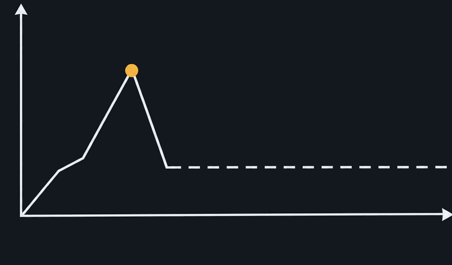

# Raster validation evidence — first-week-fatigue rejects

## Background tolerance

Target navy: `#12181D` (`18,24,29`). Chosen tolerance: **12 maximum per RGB channel**.

Why 12:

- all 32 rejected-slide corner samples were no more than 7 channel levels from target;
- an illustration/shadow control sample was `#060B11`, whose green channel is 13 levels from target;
- 12 therefore includes the measured vignette drift while excluding that nearest measured illustration sample.

Applied to rejected slide 01, the full raster changed 1,126,377 near-navy pixels and left 217,444 pixels outside tolerance untouched. In the crop below, 395,110 near-navy pixels changed and all 17,066 non-near-navy pixels stayed byte-identical. Changed non-near-navy count: **0**.

Before:


After:



The chart line, arrowheads, dashed segment, and gold dot are byte-identical. Only the near-navy field is flattened.

## REF-01 shield detector

The detector found exactly one shield in every rejected slide, with template IoU scores from `0.8669` to `0.9385`. Synthetic regression fixtures also prove:

- zero shields fails;
- two shields fail;
- one shield outside the fixed bottom-left region fails;
- one shield inside the region passes.

Raw coordinates, scores, and pixel counts: [`evidence/first-week-fatigue-evidence.json`](evidence/first-week-fatigue-evidence.json).

## Exact post-export checks

All eight rejected `1122x1402` sources were exercised through the new exporter at `1080x1350`. Every delivered file read back as exactly `1080x1350`, RGB, no alpha. REF-01 passed on all eight. Slide 03 correctly remained failed because its center control point was occupied by illustration rather than exact navy; this is the intended hard gate and triggers the one whole-slide retry.

Slide 08 Vision OCR extracted:

```text
اعمل كومنت بكلمة «خطة» ونقولك على العروض الحالية
```

Vision returned line-level rather than distinct character boxes for the two marks, so the report labels this `OCR-ONLY` instead of falsely claiming orientation proof.
